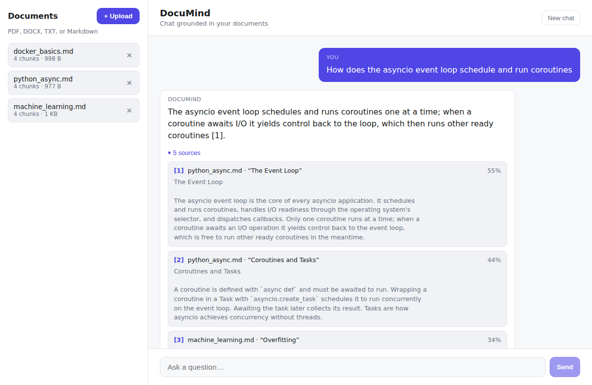
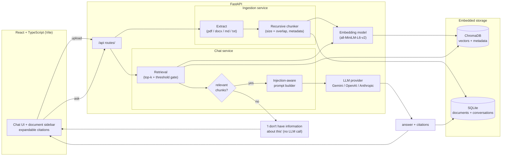

# DocuMind

Chat with your own documents — a self-hosted RAG (Retrieval-Augmented Generation) knowledge assistant.

Upload PDFs, DOCX, TXT, or Markdown files and ask questions about them. Answers are grounded in your documents with **mandatory source citations** (document + page + section); if the documents don't contain the answer, DocuMind says _"I don't have information about this in your documents"_ instead of hallucinating.



## Highlights

- **Grounded answers with citations.** Every answer cites the exact chunks it used, with filename, page number (PDF), and section heading. The UI renders expandable source snippets under each answer.
- **A real "no info" guard.** If nothing clears the relevance threshold, the LLM is never called — the assistant declines instead of guessing.
- **Prompt-injection aware.** Retrieved chunks are wrapped as untrusted **data**, and the system prompt instructs the model to ignore any instructions hiding inside them.
- **Swappable LLM.** Gemini Flash by default; OpenAI or Anthropic via a single config change, all behind one interface.
- **Multi-turn.** Conversations and citations persist in SQLite.
- **Evaluated.** A small `eval/` harness measures retrieval hit-rate@k and MRR against labelled (question, expected-source) pairs.

## Stack

- **Backend:** Python 3.11, FastAPI (async where it counts), ChromaDB (embedded), sentence-transformers
- **LLM:** Gemini Flash by default, behind a provider interface (OpenAI/Anthropic swappable via config)
- **Frontend:** React + TypeScript + Vite
- **Infra:** Docker Compose, `.env`-based configuration

## Architecture



**Layered layout** (`backend/app`): `api/` (routes + DI) → `services/` (`ingestion`, `retrieval`, `chat`, `llm`, plus `embeddings`, `vector_store`, `documents`, `conversations`) → `models/` (Pydantic schemas) → `core/` (config, logging). Services are constructed once at startup and injected into routes; the embedder and LLM provider are seams so tests run with a deterministic embedder and a fake provider — no model download, no network.

## Quickstart (Docker)

```bash
cp .env.example .env   # then set GEMINI_API_KEY

# Production-style (built images, frontend on http://localhost:3000)
docker compose up --build

# Development (hot reload, frontend on http://localhost:5173)
docker compose -f docker-compose.yml -f docker-compose.dev.yml up --build
```

Backend API docs: http://localhost:8000/docs — health check at `GET /api/health`.

## Running without Docker

```bash
# Backend
cd backend
python -m venv .venv && source .venv/bin/activate
pip install -r requirements-dev.txt
uvicorn app.main:app --reload

# Frontend (separate terminal)
cd frontend
npm install
npm run dev
```

## API

| Method | Path | Description |
| --- | --- | --- |
| `GET` | `/api/health` | Liveness + version |
| `POST` | `/api/documents` | Upload a PDF/DOCX/TXT/MD file; ingests and returns document metadata |
| `GET` | `/api/documents` | List ingested documents |
| `DELETE` | `/api/documents/{id}` | Remove a document and its vectors |
| `POST` | `/api/chat` | Ask a question; returns a grounded answer with citations (`conversation_id` optional for multi-turn) |
| `GET` | `/api/conversations` | List conversations |
| `GET` | `/api/conversations/{id}` | Full message history with citations |
| `DELETE` | `/api/conversations/{id}` | Delete a conversation |

Upload rejects unsupported types with `415` and empty/text-less files with `422`. Chat returns `grounded: false` with the fixed "no information" message when nothing clears the relevance threshold — the LLM is never called in that case. An LLM provider failure surfaces as `502`.

## Tests

```bash
cd backend
pytest            # unit + integration: chunking, extraction, retrieval, chat guard, eval, API
ruff check app tests eval
```

## Evaluation

The `eval/` harness ingests a corpus through the real pipeline and measures how
often the expected document lands in the top-k retrieved chunks (**hit-rate@k**)
plus **mean reciprocal rank (MRR)**. It ships with a sample corpus and five
labelled cases (`eval/cases.json`).

```bash
cd backend
python -m eval.run_eval                    # default corpus, k=5, real embeddings
python -m eval.run_eval --top-k 3
python -m eval.run_eval --embedder hashing # offline, no model download
python -m eval.run_eval --json             # machine-readable
```

Point it at your own data with `--cases path/to/cases.json --corpus path/to/dir`, where each case is `{"question": "...", "expected_source": "filename.ext"}`.

## Configuration

All settings live in `.env` (see `.env.example`). Key knobs:

| Variable | Default | What it controls |
| --- | --- | --- |
| `LLM_PROVIDER` / `LLM_MODEL` | `gemini` / `gemini-2.5-flash` | Answer-generation backend (`gemini`/`openai`/`anthropic`) |
| `EMBEDDING_MODEL` | `all-MiniLM-L6-v2` | sentence-transformers embedding model |
| `CHUNK_SIZE` / `CHUNK_OVERLAP` | `800` / `150` | Chunk length and overlap (characters) |
| `RETRIEVAL_TOP_K` | `5` | Chunks fetched per query |
| `RELEVANCE_THRESHOLD` | `0.25` | Min cosine similarity to count as relevant; below → "no info" |
| `MAX_HISTORY_MESSAGES` | `10` | Prior messages replayed for multi-turn context |

## Design decisions

**Recursive character chunking with overlap.** Text is split on a descending
list of separators — paragraph → line → sentence → word → character — so the
coarsest boundary that fits is used and semantically related text stays together;
finer separators are a fallback that guarantees no chunk exceeds the size limit.
Neighbouring chunks share `CHUNK_OVERLAP` characters so a fact split across a
boundary still surfaces in a retrievable chunk. Chunks **never span a page or
section boundary**, which keeps citations precise (a chunk maps to exactly one
page/section). ~800 characters is a good balance for `all-MiniLM-L6-v2`: large
enough to hold a coherent idea, small enough that a single query embedding stays
discriminative.

**Cosine similarity + a relevance threshold.** Embeddings are L2-normalized and
the Chroma collection uses cosine space, so similarity is a clean `1 − distance`
in `[0, 1]`. Retrieval takes the top-k, then drops anything below
`RELEVANCE_THRESHOLD`. This threshold is what makes the "no info" guarantee real:
when every candidate is weak the list is empty and the chat service returns the
fixed refusal **without calling the LLM** — no weak context, no hallucination,
no wasted token spend.

**Retrieved chunks are data, not instructions.** The prompt places chunks in a
delimited `CONTEXT` block and the system prompt tells the model to treat that
block strictly as data and to ignore any directions inside it. Combined with the
threshold guard, a malicious document cannot silently redirect the assistant.

**Embeddings and the LLM live behind interfaces.** `EmbeddingModel` and
`LLMProvider` are small protocols. Production wires in sentence-transformers and
Gemini; tests wire in a deterministic hashing embedder and a fake provider, so
the whole suite runs in seconds with no downloads or API calls, and swapping
providers is a config change rather than a code change.

**Embedded storage, no external services.** ChromaDB (embedded) holds vectors +
chunk metadata; SQLite holds the document registry and conversation history.
The entire stack runs from `docker compose up` with nothing to provision.
